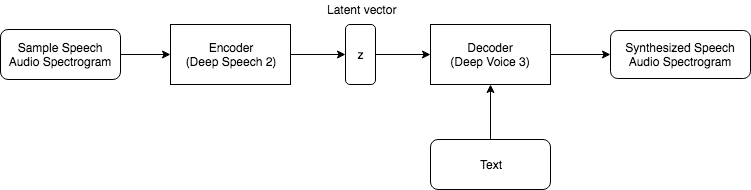

# voice-mimicker
[Understanding the features of voice and using it to
synthesize speech](report.pdf)

A neural net for mimicking someone's speech. Homework project for advanced deep learning class in METU. Read the report or ask me for details.

Audio of a speech + Text for a new sentence -> Audio of the new sentence uttered with the voice in input speech

Some examples(sample files are input voices): https://drive.google.com/drive/folders/10Y_36eAji3flbrGwAr86EV807MYS99su?usp=sharing

1.8M steps checkpoint: https://drive.google.com/open?id=1b2q_uVsAv1ChrK45kFngvnYRsrsTdhWA

    python synthesis.py --preset=presets/deepvoice3_vctk.json {checkpoint_file} {input_text_file}
    {output_dir} {input_voice}

Deepvoice 3 reference repo:
https://github.com/r9y9/deepvoice3_pytorch

Deepspeech 2 reference repo:
https://github.com/SeanNaren/deepspeech.pytorch
